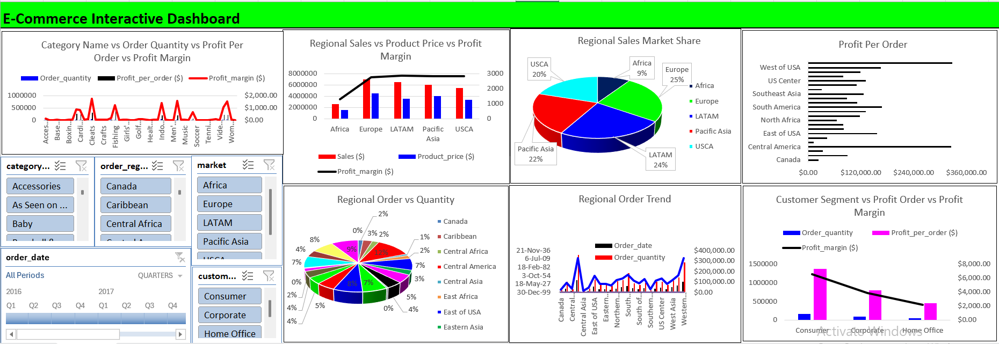

# E-Commerce Performance Insights
This interactive Excel dashboard provides a global overview of e-commerce performance by region, category, and customer segment. It delivers insights on orders, profitability, and sales, helping stakeholders make strategic, data-driven decisions in marketing, product planning, and revenue optimization.

**Title:** [E-Commerce Performance Insights](https://github.com/Osiwi/github.io/blob/main/ecommerce_cleaned_final.xlsx)

**Tools & Technologies Used:** 
Microsoft Excel: Primary platform for dashboard creation and analysis.
Pivot Tables & Pivot Charts: Used for aggregating data by region, product category, segment, and time.
Slicers & Timeline Filters: Enabled user interaction across categories like region, market, date, and customer segment.
Power Query (Get & Transform): For cleaning, merging, and reshaping datasets before visualization.
Combo Charts & Pie Charts: Visualized multiple metrics such as order quantity, profit margin, and profit per order simultaneously.
Conditional Formatting: Used to emphasize performance variations across metrics like margin and order count.

**Project Description Overview:**
This interactive Excel dashboard was developed to provide a comprehensive overview of e-commerce performance across global regions, product categories, and customer segments. It offers insights into order quantity, profitability, sales distribution, and market share—empowering stakeholders to make strategic data-driven decisions in product planning, regional marketing, and revenue optimization.

**Objective:**
To analyze and visualize multi-dimensional e-commerce data—enabling business leaders to track performance trends, identify top-performing regions and categories, and optimize profit margins across different markets and customer segments.

**Key Features Included in the Dashboard:**
Category-wise Performance Metrics: Combines order quantity, profit per order, and profit margin for each product category in a multi-axis chart.
Regional Sales vs Price vs Margin: Compares sales revenue, product pricing, and profit margin across major regions like Africa, Europe, and USCA.
Market Share Visualization: Pie chart showing regional contribution to total sales.
Profit Per Order by Region: Bar chart analyzing profitability by geographic location.
Regional Order Distribution: Pie chart detailing the percentage contribution of each region to total order quantity.
Time-based Order Trends: Line chart tracking historical order quantity by region over multiple years.
Customer Segment Profit Analysis: Combines quantity, per-order profit, and margin across Consumer, Corporate, and Home Office segments.

**Key findings:**
Europe and LATAM (Latin America) dominate regional market share, contributing a combined 49% of total sales.
Consumer segment leads in profit per order, while Corporate has the highest order volume.
Pacific Asia and USCA maintain the best balance between sales volume and profit margin.
Central America has the highest average profit per order, despite a smaller order quantity—indicating high-margin products.
Order quantities spike in several categories like Women’s, Fishing, and Boxing, showing demand concentration.
Customer segment profitability shows diminishing margins from Consumer to Home Office, signaling a need to reassess pricing or marketing strategies.
Summary:
This e-commerce dashboard brings together complex sales and profitability data into an intuitive, visually compelling format. With strong use of slicers and comparative charts, it serves as a powerful tool for business intelligence teams and decision-makers to optimize performance by geography, product, and customer type.

**Dashboard Overview:** 

